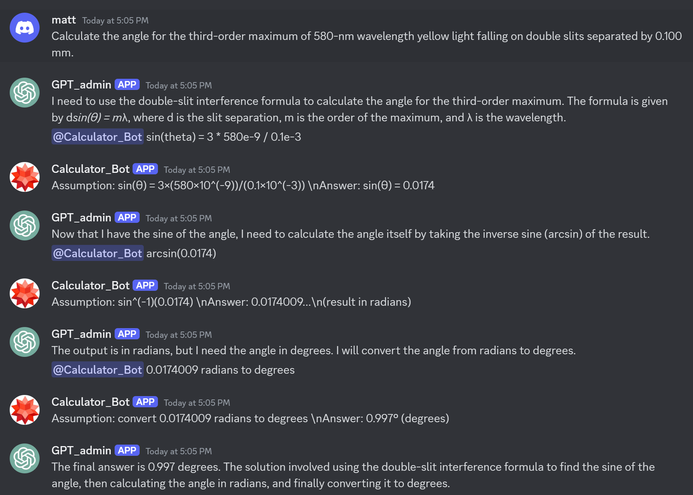

## Multi-Agent Interaction in Discord
The project deploys a GPT bot equipped with REACT-framework that cooperates with other agents through @-mentions to accomplish tasks. A WolframAlpha calculator bot is deployed as an example agent. You may include other agents. REACT-framework is compatible with multiple agents. An example interaction is shown below:

@-mentions provide a clearer and more direct visualization of agent interactions/function calling. Discord is a great platform that allows multiple bots responding to each other.

## React Framework
REACT is a prompt framework that guides LLMs to reason step by step and use tools to solve complex problems. All the responses of the LLM is prompted to be in the following format:
```json
{
    "Question": "the input question you must answer",
    "Actions": [
        {
        "Thoughts": "plan the next action. you should always think about what to do.",
        "Action": "the action to take, should be Wolfram Alpha",
        "ActionInput": "the input to the action",
        "ActionOutput": "the output from Wolfram Alpha. This is not for you to generate. You cannot change anything.",
        "Observation": "If <ActionOutput> is not empty, comment on the Action Output. Otherwise, stop here and do not include any further keys in this json."
        },
        {
        "Thoughts": "Formulate the next thought and plan the next action (repeat if futher actions is needed. otherwise if you already know the answer, end <Actions> and remeber to proceed to <FinalThought>. if you cannot answer this question, also proceed to <FinalThought> and say I don't know)",
        "Action": "(repeat if needed)",
        "ActionInput": "(repeat if needed)",
            "ActionOutput": "(the output from Wolfram Alpha)",
        "Observation": "(repeat if needed)"
        }
    ],
    "FinalThought": " (remember to proceed here if you know the final answer. also proceed here if the provided tools' functionality does not help with answering the question and state I now know the final answer)",
    "FinalAnswer": "First state 'the final answer is ...'. Then write a solution key to the original problem by including and summarizing all the previous steps."
}
```
The detailed prompt can be found [here](./react_template.txt).

## Deployment
1. create .env file:

```env
OPENAI_API_KEY=
DISCORD_ADMIN_TOKEN=
DISCORD_WOLFRAM_TOKEN=
DISCORD_ADMIN_ID=
DISCORD_WOLFRAM_ID=
WOLFRAM_ALPHA_APPID=GQ7KPQ-5K9P9R5L29
```
2. Run the following commands:
```sh
pip install -r requirements.txt
python react.py
```